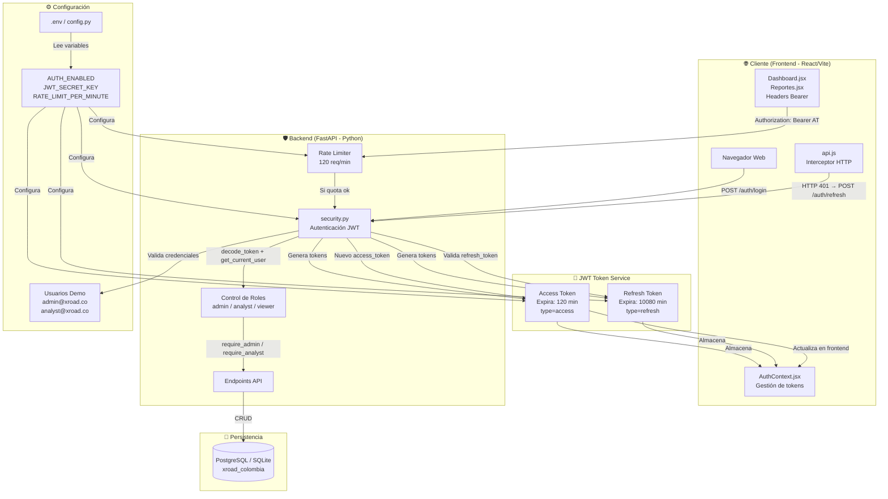

# Seguridad y Endurecimiento (Integrado)

## Arquitectura de Seguridad — Visor de Interoperabilidad

### 🖼️ Diagrama visual

Puedes visualizar el diagrama de arquitectura de seguridad de las siguientes maneras:

| Método | Descripción | Ubicación |
|--------|-------------|-----------|
| 🌐 **HTML interactivo** | Abrir en navegador (renderizado con Mermaid.js desde CDN) | `docs/security-architecture.html` |
| 📄 **Código Mermaid** | Pegar en [Mermaid Live Editor](https://mermaid.live/) | `docs/security-architecture.mmd` |
| 🖼️ **Imagen PNG** | Se genera automáticamente al ejecutar Mermaid CLI local | `docs/security-architecture.png` |



### Leyenda del diagrama

| Elemento | Descripción |
|----------|-------------|
| 🔑 **Access Token** | Token JWT de corta duración (120 min) para autenticar peticiones API |
| 🔑 **Refresh Token** | Token JWT de larga duración (10080 min = 7 días) para renovar access tokens |
| 🛡️ **Rate Limiter** | Middleware que limita a 120 peticiones/minuto por IP en rutas `/api/*` |
| 🛡️ **security.py** | Módulo central con funciones: hash de contraseñas, creación/validación de JWT, dependencias FastAPI |
| 🔐 **Control de Roles** | `require_admin` protege endpoints administrativos; `get_current_user` inyecta usuario autenticado |
| ⚙️ **Configuración** | Variables de entorno gestionadas via `config.py` con `pydantic-settings` |

### Flujo paso a paso

1. **Login**: El usuario envía credenciales → `POST /auth/login` → se validan contra usuarios demo → se generan Access Token + Refresh Token.
2. **Petición autenticada**: El frontend envía `Authorization: Bearer <access_token>` → pasa por Rate Limiter → se decodifica el token → se extrae el usuario y rol.
3. **Protección de rutas**: Si el endpoint requiere `admin`, se verifica el rol. Si no tiene permisos → `403 Forbidden`.
4. **Refresh automático**: Si el backend responde `401`, `api.js` intercepta la respuesta, llama a `POST /auth/refresh` con el refresh token, obtiene un nuevo access token y reintenta la petición original.

---

## Cambios aplicados

1. **Auth reactivada**
   - `AUTH_ENABLED=True` en `backend/.env`.

2. **JWT Access + Refresh**
   - Nuevo `refresh_token` en `POST /api/v1/auth/login`.
   - Nuevo endpoint `POST /api/v1/auth/refresh`.
   - Claims con `type=access|refresh`.

3. **Frontend con token Bearer consistente**
   - `Dashboard.jsx` y `Reportes.jsx` ahora envían `Authorization: Bearer ...`.
   - `AuthContext.jsx` guarda/limpia `xroad_refresh_token`.
   - `api.js` usa interceptor para refrescar access token al recibir `401`.

4. **Rate limiting básico backend**
   - Middleware global para rutas `/api/*`.
   - Configurable con `RATE_LIMIT_PER_MINUTE` (por defecto 120).

## Variables relevantes en `.env`

```env
AUTH_ENABLED=True
ACCESS_TOKEN_EXPIRE_MINUTES=120
REFRESH_TOKEN_EXPIRE_MINUTES=10080
RATE_LIMIT_PER_MINUTE=120
```

## Pendientes recomendados (producción)

- Mover secretos a vault/secret manager.
- Rotación de `JWT_SECRET_KEY` y credenciales.
- Añadir persistencia/blacklist de refresh tokens.
- Auditoría estructurada (SIEM) y alertas.
- MFA para cuentas administrativas.